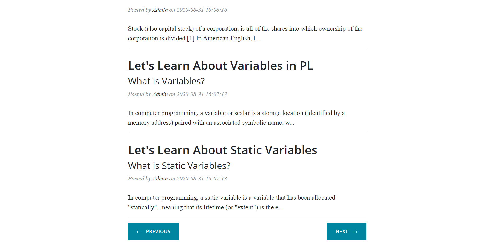

# flask_blog
A Simple Blog App to Add a Blog.

# How to Use

first import flask package of python by this command on command prompt:
```
  pip install flask
```

clone this repository by following Command.
```
  git clone https://github.com/harikanani/flask_blog.git
```
goto the file location
```
  flask_blog
```
and then open Command Prompt there and type following command
```
  python main.py
```

# Output Screens
# HomePage


# HomePage With Blogs



# AboutPage


# Contact Us Page


